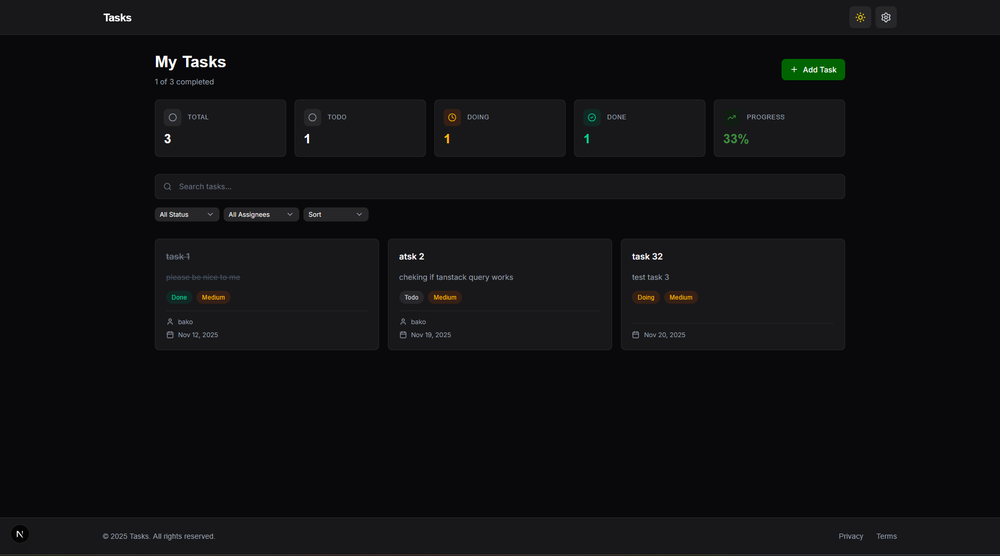
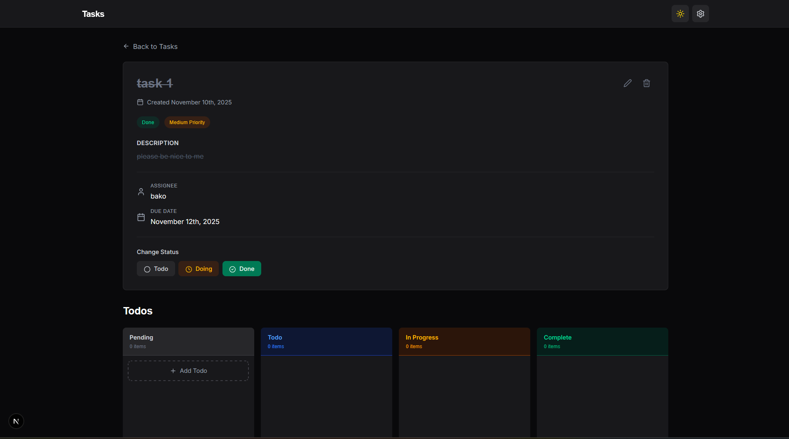
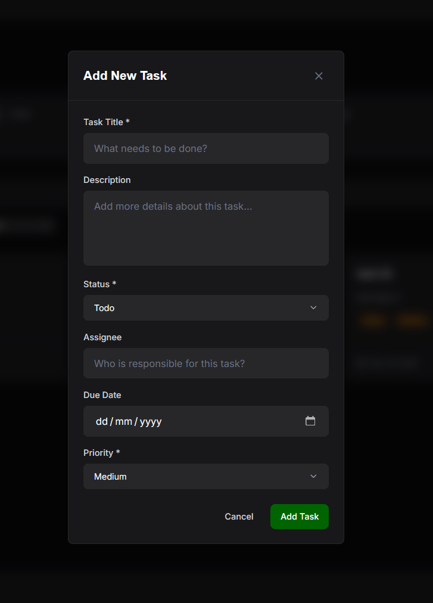

# 📋 Interview Todo App

A modern, full-featured task management application built with Next.js, featuring a beautiful UI, dark mode support, and real-time task tracking with subtodos.


## ✨ Features

- **📝 Task Management**: Create, edit, and delete tasks with detailed information
- **🎯 Subtodos (Kanban Board)**: Break down tasks into subtodos with drag-and-drop functionality
- **🎨 Dark Mode**: Beautiful light and dark themes with smooth transitions
- **🔍 Search & Filters**: Search tasks and filter by status, assignee, and sort by priority/due date
- **📊 Analytics Dashboard**: View task statistics and completion rates
- **♿ Accessibility**: Full keyboard navigation, ARIA labels, and screen reader support
- **🎯 Progress Tracking**: Automatic task progress calculation based on subtodo completion
- **💾 Persistent Storage**: JSON Server for mock REST API persistence
- **🧪 Testing**: Unit tests with Jest and React Testing Library
- **⚡ Performance**: Optimistic updates, skeleton loaders, and efficient data fetching with TanStack Query

## 🚀 Getting Started

### Prerequisites

- Node.js 18+ and npm (or yarn/pnpm)
- Git

### Installation

1. **Clone the repository** (or navigate to the project directory)

```bash
git clone <repository-url>
cd tasks
```

2. **Install dependencies**

```bash
npm install
# or
yarn install
# or
pnpm install
```

### Running the Application

> **⚠️ Important**: This application requires **two servers** to run simultaneously. Make sure both are running before using the app.

#### Step 1: Start the JSON Server

The JSON Server provides the backend API for data persistence. Open a terminal window and run:

```bash
npm run server
```

This will:
- Start the JSON Server on `http://localhost:3001`
- Watch the `db.json` file for changes
- Provide REST API endpoints for tasks and todos

**Keep this terminal window open** while developing.

#### Step 2: Start the Next.js Development Server

Open a **new terminal window** (keep the JSON Server running in the first one) and run:

```bash
npm run dev
```

This will:
- Start the Next.js development server
- Make the application available at [http://localhost:3000](http://localhost:3000)
- Enable hot-reload for development

#### Quick Start (Both Servers)

If you want to run both servers at once, you can use two terminal windows:

**Terminal 1:**
```bash
npm run server
```

**Terminal 2:**
```bash
npm run dev
```

Then open [http://localhost:3000](http://localhost:3000) in your browser.

> **Note**: The JSON Server must be running on port 3001 for the application to work properly. If port 3001 is already in use, you can modify the port in the `package.json` script or stop the conflicting service.

### Building for Production

```bash
npm run build
npm start
```

### Running Tests

```bash
# Run all tests
npm test

# Run tests in watch mode
npm run test:watch

# Run tests with coverage
npm run test:coverage
```

## 📖 How It Works

### Architecture Overview

The application follows a modern React architecture with:

- **Next.js Pages Router** for routing
- **React Context API** for global state management
- **TanStack Query** for server state management and caching
- **JSON Server** as a mock REST API backend
- **Tailwind CSS** for styling with custom design system

### Key Components

#### 1. **Home Page** (`/`)

The home page displays:

- **Analytics Dashboard**: Shows task counts by status (Todo, Doing, Done) and overall completion percentage
- **Search & Filters**: 
  - Search bar for finding tasks by title, description, or assignee
  - Status filter (All, Todo, Doing, Done)
  - Assignee filter (dynamically populated from existing tasks)
  - Sort options (Due Date, Priority)
  - Reset button to clear all filters
- **Task Grid**: Responsive card layout showing all tasks with:
  - Title and description
  - Status and priority badges
  - Assignee and due date
  - Progress bar (based on subtodo completion)
  - Quick actions (view, delete)


*Home page with analytics, search, filters, and task grid*

#### 2. **Task Detail Page** (`/tasks/[id]`)

The task detail page provides:

- **Task Information**:
  - Editable title and description
  - Status and priority (editable via dropdowns)
  - Assignee and due date (editable)
  - Creation date
  - Progress bar showing subtodo completion

- **Kanban Board for Subtodos**:
  - Four columns: Pending, Todo, In Progress, Complete
  - Drag-and-drop to move subtodos between columns
  - Add new subtodos directly in the Pending column
  - Delete subtodos with confirmation
  - Change status via dropdown menu

- **Quick Actions**:
  - Edit mode toggle
  - Delete task (with confirmation)
  - Status change buttons


*Task detail page with Kanban board for subtodos*

#### 3. **Add Task Modal**

A fully accessible modal for creating new tasks with:

- Form validation with inline error messages
- Required fields: Title, Status, Priority
- Optional fields: Description, Assignee, Due Date
- Toast notifications for success/error
- Keyboard navigation support


*Add task modal with form validation*

### Data Flow

1. **Data Fetching**: TanStack Query handles all API calls with automatic caching and refetching
2. **Optimistic Updates**: UI updates immediately while API calls are in progress
3. **Error Handling**: Failed operations revert optimistic updates and show error toasts
4. **Persistence**: All changes are saved to `db.json` via JSON Server

### State Management

- **Global State** (`TasksContext`): Provides task operations (add, update, delete, etc.)
- **Server State** (TanStack Query): Manages API data, caching, and synchronization
- **UI State**: Local component state for modals, forms, and interactions

### Theme System

- **next-themes** for theme management
- **Class-based dark mode** with Tailwind CSS
- **Persistent theme** stored in localStorage
- **Smooth transitions** between themes

### Accessibility Features

- **Keyboard Navigation**: Full keyboard support for all interactions
- **ARIA Labels**: Proper labeling for screen readers
- **Focus Management**: Automatic focus trapping in modals
- **Live Regions**: Announcements for validation errors and status changes
- **Semantic HTML**: Proper use of headings, landmarks, and roles

## 🛠️ Tech Stack

- **Framework**: Next.js 16.0 (Pages Router)
- **Language**: TypeScript 5.0
- **Styling**: Tailwind CSS 4.0
- **State Management**: 
  - React Context API (global state)
  - TanStack Query 5.90 (server state)
- **Icons**: Lucide React
- **Date Formatting**: date-fns
- **Testing**: Jest, React Testing Library
- **Backend**: JSON Server (mock REST API)
- **Theme**: next-themes

## 📁 Project Structure

```
tasks/
├── src/
│   ├── components/          # Reusable UI components
│   │   ├── buttons/        # Button components
│   │   ├── menus/          # Select menu component
│   │   ├── modals/         # Modal components
│   │   ├── navigation/     # Navbar and footer
│   │   ├── skeletons/      # Loading skeletons
│   │   └── todos/          # Todo-related components
│   ├── contexts/           # React contexts
│   │   ├── tasks-context.tsx
│   │   ├── toast-context.tsx
│   │   └── theme-context.tsx
│   ├── hooks/              # Custom React hooks
│   │   ├── use-modal.ts
│   │   └── use-tasks-query.ts
│   ├── layouts/            # Layout components
│   ├── pages/              # Next.js pages
│   │   ├── index.tsx       # Home page
│   │   └── tasks/
│   │       └── [id].tsx    # Task detail page
│   ├── styles/             # Global styles
│   └── utils/              # Utility functions
│       ├── api.ts          # API client
│       └── task-progress.ts
├── db.json                 # JSON Server database
├── package.json
├── tailwind.config.ts
└── tsconfig.json
```

## 🎨 Design System

The application uses a custom design system with:

- **Colors**: Professional palette with slate, gray, blue, and custom accent colors
- **Typography**: Inter font family with semantic font classes (heading, paragraph, badge, buttons)
- **Spacing**: Consistent spacing scale
- **Components**: Reusable, accessible components with consistent styling

## 🧪 Testing

The project includes unit tests for:

- Form validation in `AddTaskModal`
- Todo creation in `AddTodoForm`

Run tests with:

```bash
npm test
```

## 📝 API Endpoints

The JSON Server provides the following endpoints:

- `GET /tasks` - Get all tasks
- `GET /tasks/:id` - Get a single task
- `POST /tasks` - Create a new task
- `PATCH /tasks/:id` - Update a task
- `DELETE /tasks/:id` - Delete a task
- `GET /todos` - Get all todos
- `POST /todos` - Create a new todo
- `PATCH /todos/:id` - Update a todo
- `DELETE /todos/:id` - Delete a todo

## 🚧 Development

### Adding New Features

1. Create components in `src/components/`
2. Add API methods in `src/utils/api.ts`
3. Create React Query hooks in `src/hooks/use-tasks-query.ts`
4. Update context if needed in `src/contexts/tasks-context.tsx`

### Code Style

- TypeScript for type safety
- ESLint for code quality
- Consistent component structure
- Accessibility-first approach

## 📸 Screenshots

> **Note**: Add screenshots to a `screenshots/` directory in the project root. The following placeholders are referenced in the README:

1. **Home Page** (`screenshots/home-page.png`) - Shows the analytics dashboard, search/filters, and task grid
2. **Task Detail Page** (`screenshots/task-detail.png`) - Shows the task information and Kanban board
3. **Add Task Modal** (`screenshots/add-task-modal.png`) - Shows the task creation form
4. **Dark Mode** (`screenshots/dark-mode.png`) - Shows the application in dark theme
5. **Mobile View** (`screenshots/mobile-view.png`) - Shows responsive design on mobile devices

## 🤝 Contributing

This is an interview project, but suggestions and improvements are welcome!

## 📄 License

This project is private and for interview purposes only.

---

Built with ❤️ using Next.js and TypeScript
